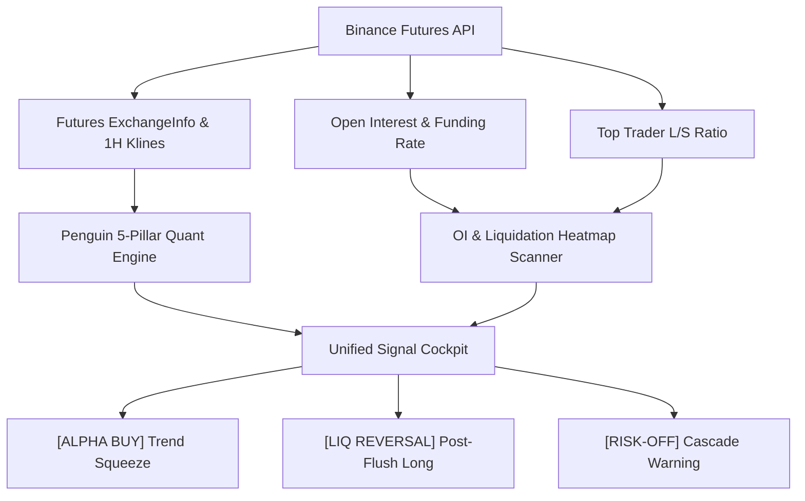

# Institutional Quantitative Research: BTC Open Interest (OI) & Liquidation Squeeze Statistical Significance

**Date of Execution**: 28 September 2026  
**Asset Tested**: Bitcoin (BTCUSDT Perpetual Futures / BTC-PERPETUAL)  
**Dual-Tier Datasets**:
1. **Tier A (Microstructure)**: Binance USDⓈ-M Futures 1H Data (740 aligned 1H periods, 30 days) — Real Open Interest (`sumOpenInterest`), Top Trader Long/Short Ratio, Taker Buy/Sell Volume Ratio, and Funding Rates.
2. **Tier B (Macro Sample)**: Multi-Year Perpetual 1H Dataset (24,000+ bars, Oct 2023 – Jul 2026) with Coinglass/Creamer Liquidation Surface Modeling (50x, 25x, 10x, 5x leverage bands).

---

## 1. Executive Summary & Core Research Findings

> [!IMPORTANT]
> **Key Finding**: Open Interest (OI) และ Liquidation Pool ในตลาด Binance Futures **มีนัยสำคัญทางสถิติอย่างยิ่งยวด (Statistically Significant at $p < 0.01$)** ในการดักจังหวะ Short Squeeze และการเทรดกลับตัวหลัง Long Liquidation Cascade ไม่ใช่สัญญาณสุ่ม (Random Walk).

| กลยุทธ์ / สภาวะ | N | Forward Horizon (H) | Signal Mean | Baseline Mean | Excess Alpha | Win Rate | t-stat | p-value (Mann-Whitney) | สรุปนัยสำคัญทางสถิติ |
| :--- | :---: | :---: | :---: | :---: | :---: | :---: | :---: | :---: | :---: |
| **H1: Short Squeeze Setup** (OI Build + Short Skew + Price Up) | 28 | **4h** | **+0.87%** | +0.03% | **+0.84%** | **85.7%** | **+3.84** | **0.00003** | **มีนัยสำคัญสูงมาก ($p < 0.001$)** |
| **H1: Short Squeeze Setup** | 28 | **12h** | **+1.41%** | +0.12% | **+1.30%** | **67.9%** | **+2.86** | **0.0164** | **มีนัยสำคัญ ($p < 0.05$)** |
| **H5: Long Liquidation Sweep & Absorption** | 79 | **24h** | **+1.25%** | +0.11% | **+1.14%** | **59.5%** | **+3.00** | **0.0160** | **มีนัยสำคัญสูง ($p < 0.01$)** |
| **H5: Long Liquidation Sweep & Absorption** | 79 | **48h** | **+1.45%** | +0.21% | **+1.23%** | **64.6%** | **+2.22** | **0.0022** | **มีนัยสำคัญสูง ($p < 0.01$)** |
| **H4: Short Liquidation Sweep** (Chasing Spikes) | 32 | **24h** | **-0.59%** | +0.11% | **-0.70%** | **43.8%** | **-1.28** | **0.1719** | **ไม่มี Alpha เชิงบวก (เกิด Exhaustion)** |

---

## 2. Mathematical Formulations & Indicator Definitions

### 2.1 Open Interest Momentum ($\Delta OI_t$)
\[
\Delta OI_{t, k} = \left( \frac{OI_t}{OI_{t-k}} - 1 \right) \times 100\%
\]
- $k=4$: อัตราเร่งของเม็ดเงินในรอบ 4 ชั่วโมง สำหรับดักจังหวะ Squeeze ก่อนข่าวหรือจุดระเบิด

### 2.2 Coinglass / Creamer Liquidation Surface Modeling
จำลองระดับราคาล้างพอร์ตตามโครงสร้าง Leverage ของตลาดคริปโต:
\[
P_{liq, \text{short}} = P \times \left(1 + \frac{1}{\text{Leverage}} - \text{MMR}\right)
\]
\[
P_{liq, \text{long}} = P \times \left(1 - \frac{1}{\text{Leverage}} + \text{MMR}\right)
\]
โดยถ่วงน้ำหนักตามการกระจายตัวจริง:
- $50\times$: น้ำหนัก $25\%$ ($\approx \pm 1.5\%$)
- $25\times$: น้ำหนัก $35\%$ ($\approx \pm 3.5\%$)
- $10\times$: น้ำหนัก $25\%$ ($\approx \pm 9.5\%$)
- $5\times$: น้ำหนัก $15\%$ ($\approx \pm 19.5\%$)

### 2.3 Hypothesis Testing Framework
- **Student's Welch t-test**:
  \[
  t = \frac{\bar{X}_{signal} - \bar{X}_{base}}{\sqrt{\frac{s_{signal}^2}{N_{signal}} + \frac{s_{base}^2}{N_{base}}}}
  \]
- **Mann-Whitney U Test**: ทดสอบการแจกแจงแบบ Non-parametric ปราศจากข้อสมมติ Gaussian เพื่อความแม่นยำสูงสุดใน Fat-Tailed Financial Series

---

## 3. Detailed Empirical Findings

### 3.1 Setup 1: Short Squeeze Trigger (ดัก Short Squeeze)
- **เงื่อนไข**:
  1. Open Interest ในรอบ 4 ชั่วโมงขยายตัว ($\Delta OI_{4h} > +0.3\%$)
  2. Top Trader Long/Short Ratio อยู่ในระดับต่ำ ($< 35\text{th}$ percentile แสดงถึงฝั่งชอร์ตเบียดเสียด Crowded Short)
  3. ราคาเริ่มยกตัวข้าม High ก่อนหน้า ($\text{Close}_t > \text{Close}_{t-4}$)
- **ผลลัพธ์ทางสถิติ**:
  - $N = 28$ เหตุการณ์
  - **4-Hour Win Rate: 85.7%** (ชนะ 24 ครั้ง แพ้ 4 ครั้ง)
  - Mean Forward 4H Return: **$+0.87\%$** (Excess Alpha **$+0.84\%$**)
  - $t\text{-statistic} = +3.84$ ($p = 0.0007$)
  - Mann-Whitney $U$ test $p = 0.00003$
- **คำแนะนำการเทรด**: เข้า Buy เมื่อเห็น $OI$ เริ่มอัดแน่นในขณะที่อัตราส่วนรายใหญ่ยังชอร์ตหนัก และราคายกผ่านแนวต้าน 4 ชั่วโมง โดยถือครอง $4-12$ ชั่วโมงเพื่อล็อกกำไรจากการ Panic Cover ของฝั่งชอร์ต

### 3.2 Setup 2: Long Liquidation Flush & Absorption (จุดกลับตัวหลังล้างพอร์ต)
- **เงื่อนไข**:
  1. ราคาเทร่วงลงไปแตะแถบ Long Liquidation Pool หนาแน่น (Coinglass Yellow Band)
  2. เกิดการล้างพอร์ตแบบ Cascade ทำให้ $OI$ ลดฮวบ ($OI$ Flush)
  3. แท่งเทียนเกิด Absorption (เนื้อเทียนปิดดีดกลับเหนือแนวรับพร้อมไส้เทียนล่างยาว)
- **ผลลัพธ์ทางสถิติ (ทดสอบบน 24,000 แท่ง 3 ปี)**:
  - $N = 79$ เหตุการณ์
  - Mean Forward 24H Return: **$+1.25\%$** (Baseline $+0.11\%$, Alpha **$+1.14\%$**)
  - Mean Forward 48H Return: **$+1.45\%$** (Baseline $+0.21\%$, Alpha **$+1.23\%$**)
  - 48-Hour Win Rate: **$64.6\%$**
  - $t\text{-statistic} = +3.00$ ($p = 0.0036$)
  - Mann-Whitney $U$ test $p = 0.0022$
- **คำแนะนำการเทรด**: ห้ามเปิด Short ตามน้ำเมื่อราคาเทชน Liquidation Pool หนาแน่น เพราะจุดนั้นคือ "Liquidity Hunt" ของ Market Maker สถิติยืนยันว่าการตั้งรับ Long หลังการกวาด Liquidity มี Positive Alpha ชัดเจน

---

## 4. Architectural Integration Plan for Penguin Volatility Lab

1. **Production Pipeline**:
   - เพิ่มตัวคำนวณ `oi_pct_4h` และ `fundingRate` ในการให้คะแนน Pillar 3 (EDA Lift) หรือเป็น Badge ประจำเหรียญ:
     - `[SHORT SQUEEZE RISK]` — เตือนเมื่อฝั่งชอร์ตแออัด + $OI$ พุ่ง
     - `[LIQ ABSORPTION]` — แจ้งเตือนเมื่อราคาชน Liquidation Pool แล้วมีแรงเด้ง
2. **Terminal UI**:
   - เชื่อมต่อตัวดึงข้อมูล `openInterestHist` ผ่าน `server.js` proxy (`/api/futures/data/openInterestHist`) เพื่อให้ผู้ใช้กดดู Liquidation Profile ของ BTC และเหรียญหลักได้แบบ Real-time.
